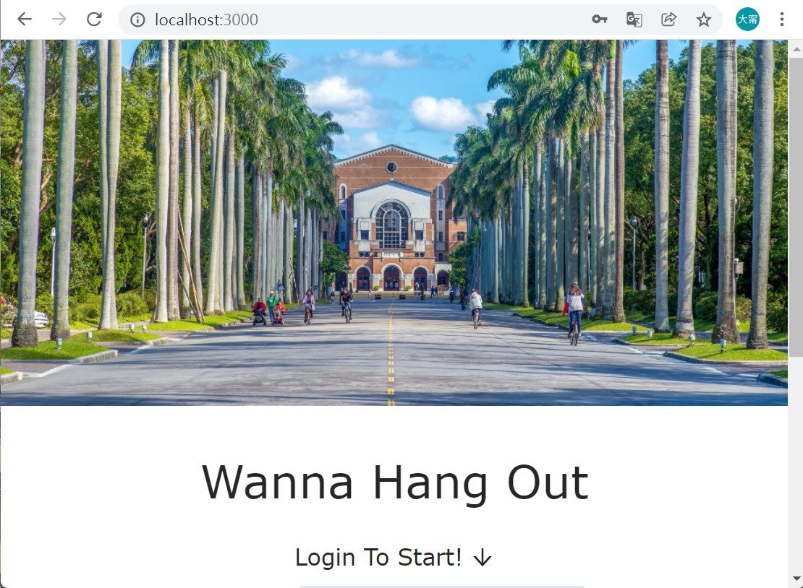
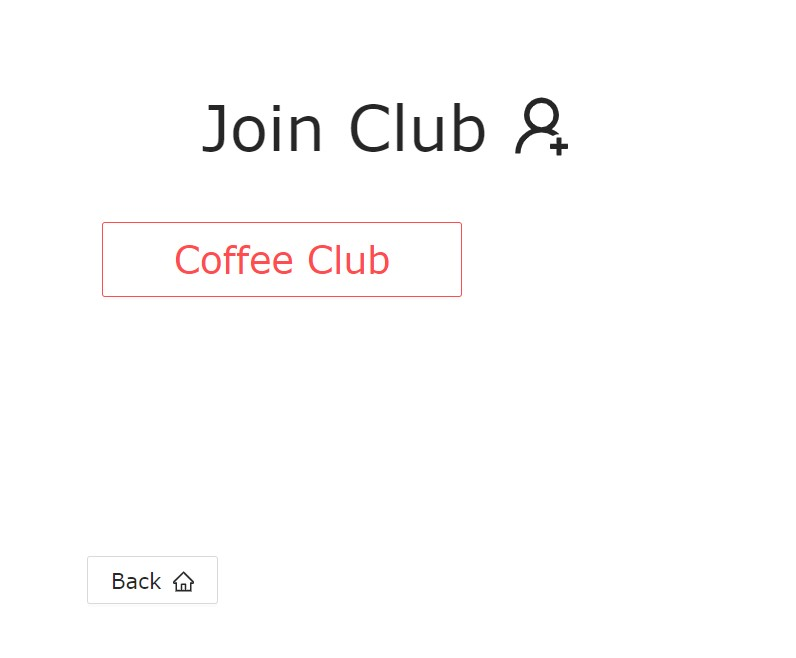
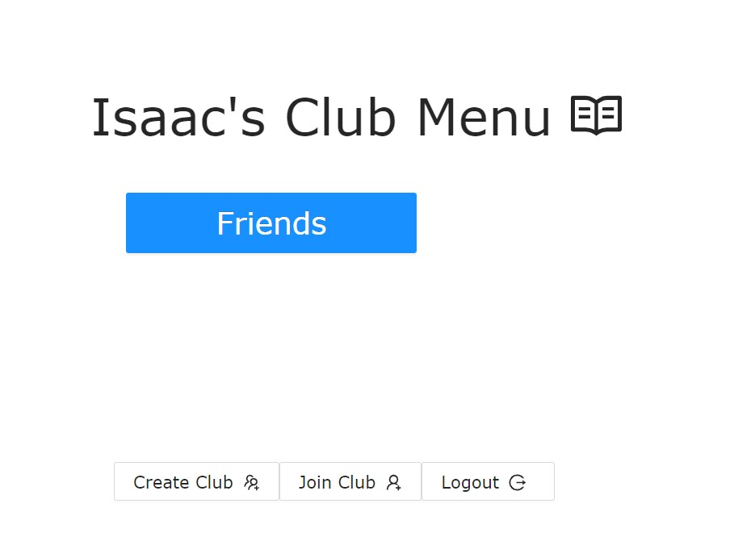
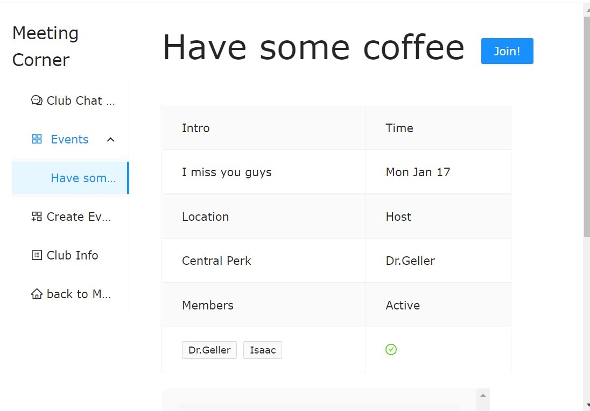
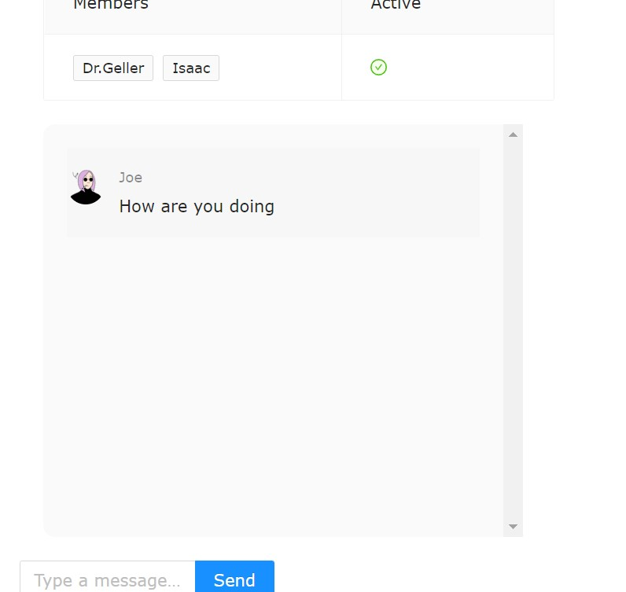

# Wanna Hang Out?

A lightweight club & event management web application that streamlines how university groups plan events and stay connected.

## ✨ Key Features

* **Real‑time subscriptions** – GraphQL Subscriptions deliver instant updates for new events and chats.
* **Event‑centric chat** – Each event has its own channel, so conversations stay focused and never drown in group noise.
* **Role‑based access** – Secure JWT authentication with bcrypt‑hashed passwords.
* **One‑click RSVPs** – Subscribe or unsubscribe to events instantly; automatic reminders coming soon.
* **CI/CD** – GitHub Actions deploy the front‑end & back‑end to Heroku on every push. (hidden on demo)

## Live Demo

[▶ Watch the demo](https://youtu.be/PxESAjJTIuw)  
Click [here](https://wannahangout1101.herokuapp.com) for the deployed website  
*If the demo is sleeping, give Heroku a second to spin up ⏳*

## 🛠 Tech Stack

| Layer     | Tech                                                        |
| --------- | ----------------------------------------------------------- |
| Frontend | React · Apollo Client · GraphQL Subscriptions |
| Backend  | Node.js · GraphQL‑Yoga · Express · Mongoose · MongoDB       |
| DevOps    | GitHub Actions · Heroku · dotenv                            |

## 🚀 Quick Start

```bash
git clone https://github.com/huan80805/wp1101_proj.git
cd wanna-hangout

# Front‑end
cd frontend
yarn install
yarn start
# visit http://localhost:3000

# Back‑end (in a new terminal)
cd ../backend
yarn install
yarn start
# GraphQL playground: http://localhost:4000/graphql
```

## 📸 Screenshots

|                              |                              |                             |
| ---------------------------- | ---------------------------- | --------------------------- |
| Login                        | Join Club                    | Club Lobby                  |
|      |   |  |
| Event Info                   | Event Chat                   |                             |
|  |  |                             |

